<div align="center">

<h3><code>kaabilgaurav@github ~ $ ./contributions.sh</code></h3>



<br><br>

<h3><code>kaabilgaurav@github ~ $ whoami</code></h3>

<table>
<tr>
<td valign="top">

</td>

<td valign="top">

</td>
</tr>
</table>

<br><br>

<h3><code>kaabilgaurav@github ~ $ ./links.sh</code></h3>

<b>Software Developer • Java Full Stack Developer • Backend Engineer</b>

<br><br>

<a href="https://github.com/kaabilgaurav">

</a>

<a href="https://www.linkedin.com/in/gauravchaudhary10/">

</a>

<a href="mailto:tech.gauravchaudhary@gmail.com">

</a>

</div>

---

# 👋 About Me

```bash
Name      : Gaurav Chaudhary
Role      : Software Developer
Location  : Indore, India
Education : B.Tech CSIT
College   : IPS Academy